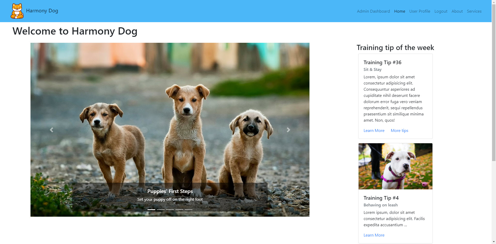
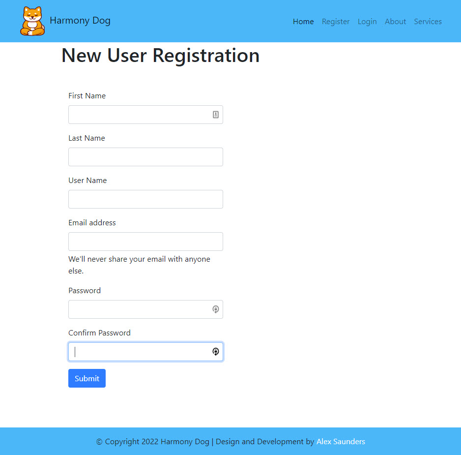
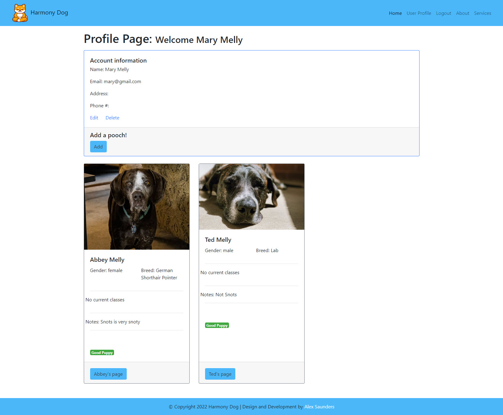
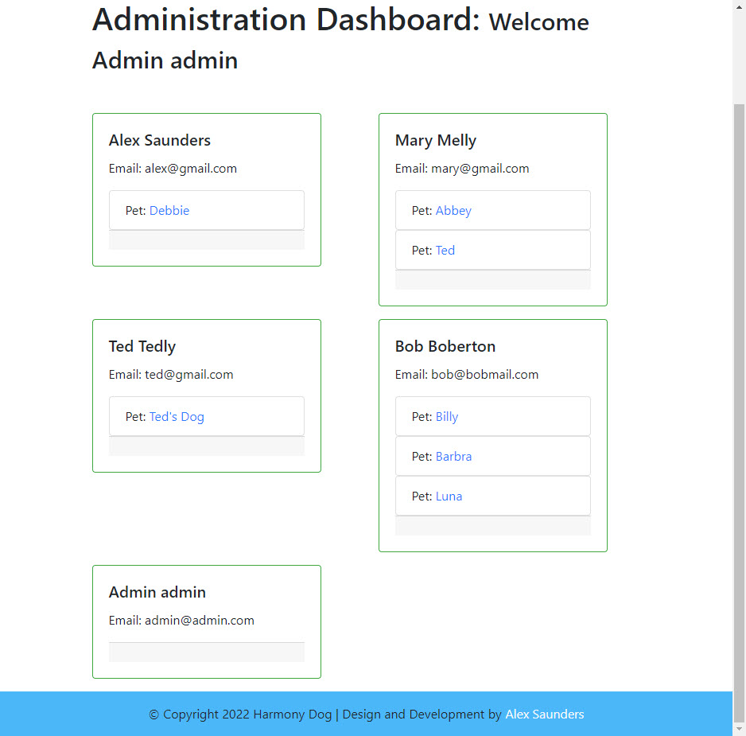

# Harmony Dog - Small business dog training website

## Table of contents

- [Harmony Dog - Small business dog training website](#harmony-dog---small-business-dog-training-website)
	- [Table of contents](#table-of-contents)
	- [Overview](#overview)
		- [The challenge](#the-challenge)
		- [Screenshots](#screenshots)
			- [Desktop](#desktop)
			- [Mobile](#mobile)
		- [Links](#links)
	- [My process](#my-process)
		- [Built with](#built-with)
		- [What I learned](#what-i-learned)
		- [Code Snippets](#code-snippets)
			- [JavaScript](#javascript)
		- [Continued development](#continued-development)
		- [Useful resources](#useful-resources)
	- [Author](#author)

## Overview

### The challenge

Develop a website for a small business based on dog training and dog walking.

- Users should be able to:
  - Create an account
  - Login / Logout
  - See, edit, and delete their account
  - Create dog profiles for their pet(s)
  - See, edit, and delete their dog's profiles
  - Get information about the services offered
  - Enroll their dog(s) for classes, training sessions, or dog walks
  - See which classes their dog(s) are enrolled in, their progress, and completed classes/behaviors

- Administration should be able to:
	- Login / Logout
	- See, edit, and delete client(user) accounts (only pertinent information available)
	- See, edit, and delete client dog profiles
	- See, edit, and delete classes dogs have enrolled in
	- Adjust the classes, class progress, behaviors learned for each dog
	- See, edit, and delete the services available to the clients and their dogs

### Screenshots

#### Desktop








#### Mobile


### Links

- Live Site URL: [https://harmonydog.herokuapp.com/](https://harmonydog.herokuapp.com/)

## My process

### Built with

- JavaScript
- Semantic HTML5 markup
- Bootstrap5 library with some custom CSS 
- Embedded JavaScript templating (EJS)
- NodeJS
- Express
- MongoDB & Mongoose
- Passport
- Cloudinary & Multer
- VSCode

### What I learned

Harmony Dog let me really explore and play with the Bootstrap5 library. Given the time I'd like to circle back and write some custom CSS to make the site a little more unique, but he speed at which you can get a Bootstrap site up and looking fine is amazing.

I enjoyed putting ejs thorough its paces here and got to know the templating language a little more thoroughly than on other projects.

I dipped into aggregations with MongoDB, pulling two collections together to create a temporary document. I'm seeing the benefit of a NoSQL database here and the project grows and new ideas need to be incorporated into the system architecture.

### Code Snippets
#### JavaScript

Here's my aggregation pulling in data from the dogs collection and linking it with the appropriate user so that I can display user and pet information on an administration dashboard. Using the Atlas interface on MongoDB and looking through their extensive documentation made this a breeze.

```javascript
const users = await User.aggregate([
        {
          $lookup: {
            from: 'dogs',
            localField: '_id',
            foreignField: 'owner',
            as: 'pets',
          },
        },
      ]);
```

### Continued development

Work needs to be done to bring in the class structure to the page and enable users to sign their pets up for classes. Those classes will then be shown on the pet profile page, along with their progress through the class. Pets will have a list of behaviors shown on their profile as well. 

Users will be able to access class material so that they can continue the training on their own. Material will include visual and vocal cues, perhaps bringing in video, as well as intermediary steps in the training pathway.

### Useful resources


## Author

- Website - [Aleksei Saunders](https://alekseisaunders.com/)
- GitHub - [Aleksei Saunders](https://github.com/AlekseiSaunders)
- LinkedIn - [Aleksei Saunders](https://www.linkedin.com/in/alekseisaunders/)
  
